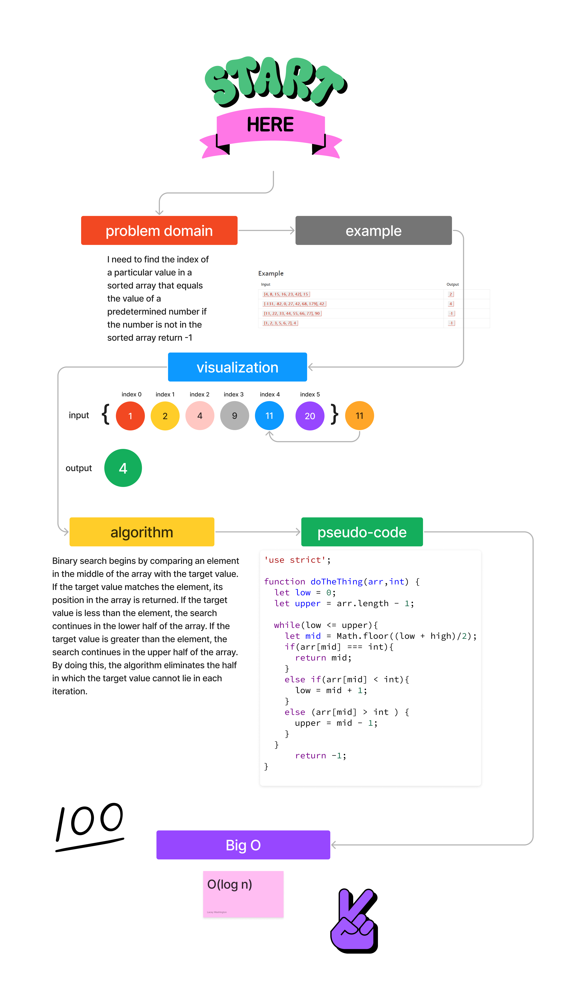

# array-binary-search

<!-- Description of the challenge -->

Write a function called BinarySearch which takes in 2 parameters: a sorted array and the search key. Without utilizing any of the built-in methods available to your language, return the index of the array’s element that is equal to the value of the search key, or -1 if the element is not in the array.

## Whiteboard Process

<!-- Embedded whiteboard image -->

## Approach & Efficiency

<!-- What approach did you take? Why? What is the Big O space/time for this approach? -->

I used a while loop because I needed to be able to check if the value of the search key was equal to the value of the element being searched for. Need to create 3 variables to store what we need then return if element is found or not.

## Solution

<!-- Show how to run your code, and examples of it in action -->

let arr = [4, 8, 15, 16, 7, 42];
doThethig(arr, 7)
