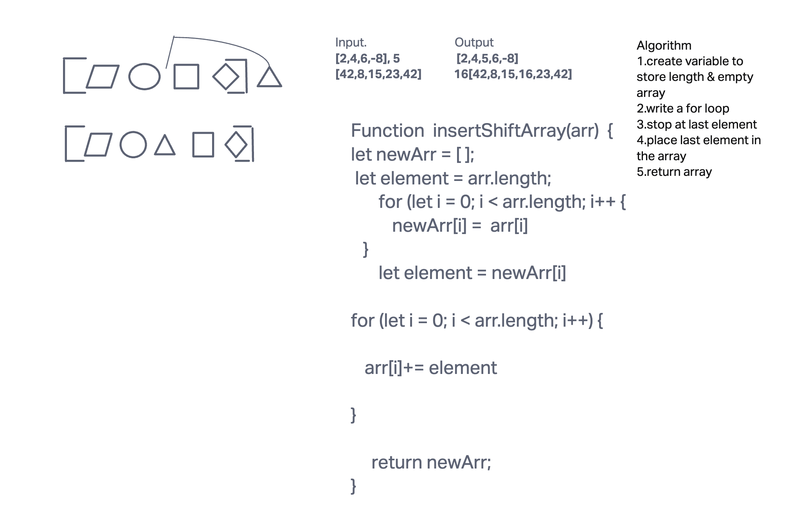

# arry insert shift

<!-- Description of the challenge -->

Write a function called insertShiftArray which takes in an array and a value to be added. Without utilizing any of the built-in methods available to your language, return an array with the new value added at the middle index.

## Whiteboard Process

<!-- Embedded whiteboard image -->

## Approach & Efficiency

<!-- What approach did you take? Why? What is the Big O space/time for this approach? -->

I took this approach because it was the first thing that came to mind. I think having 2 for loops you can add or remove elements. Make a empty array will be the same length as the original array. Then you can add the new value to the middle of the array.

## Solution

<!-- Show how to run your code, and examples of it in action -->

let arr = [1, 2, 3, 4, 5];
let value = 6;
let result = insertShiftArray(arr);
console.log(result);
