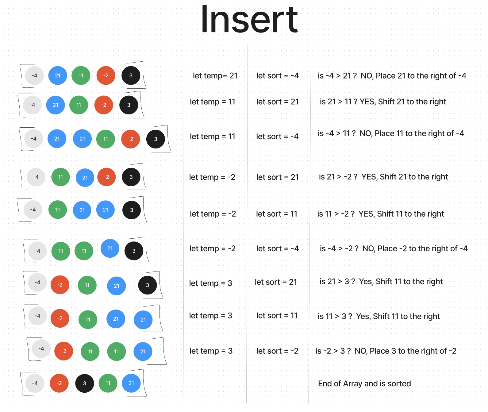

# Insertion Sort Blog

The insertion sort algorithm is a sorting algorithm that sorts an array by iterating through the array and comparing each element to the element before it. If the element before it is greater than the current element, the current element is moved to the left until it is in the correct position. This process is repeated until the array is sorted. For example the array [8,4,23,42,16,15]. The first element is 8. The second element is 4. 4 is less than 8 so 4 is moved to the left of 8. The array is now [4,8,23,42,16,15]. The third element is 23. 23 is greater than 8 and 4 so it stays in place. The array is now [4,8,23,42,16,15]. The fourth element is 42. 42 is greater than 23, 8, and 4 so it stays in place. The array is now [4,8,23,42,16,15]. The fifth element is 16. 16 is less than 42 so it is moved to the left of 42. The array is now [4,8,23,16,42,15]. The sixth element is 15. 15 is less than 42 and 16 so it is moved to the left of 16. The array is now [4,8,23,15,16,42]. The array is now sorted.

My other visualizations example can be found below:

